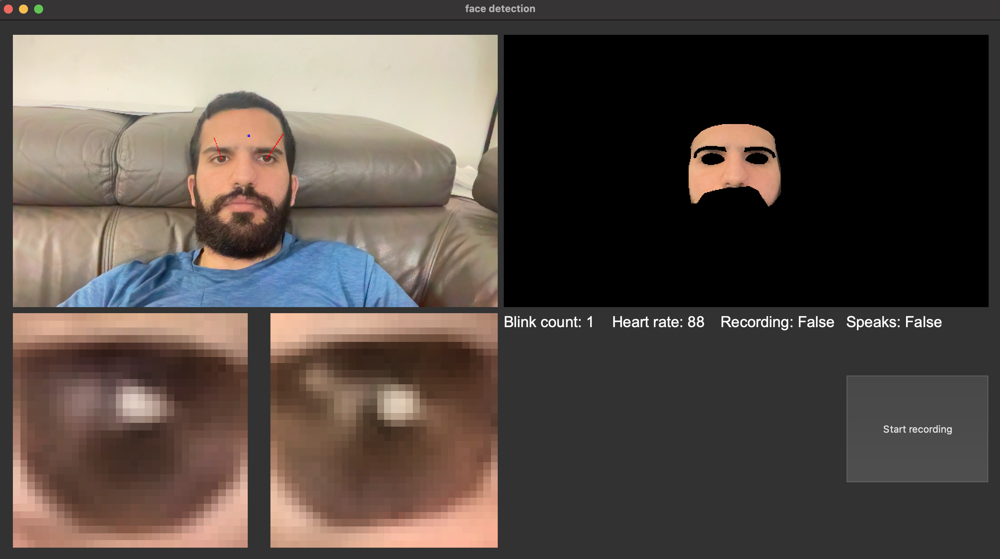

# vision_physiology

Detecting pulse, speaker, blinking and eye-gaze using a simple webcam.  
Gui implemented using pyQt.   
Run gui.py to start the program. 
  
Heart-rate- Implemanted using r-ppg algorithm https://pure.tue.nl/ws/portalfiles/portal/31563684/TBME_00467_2016_R1_preprint.pdf. 
eye-tracking- https://medium.com/mlearning-ai/eye-gaze-estimation-using-a-webcam-in-100-lines-of-code-570d4683fe23

  
